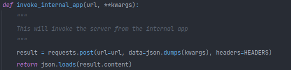
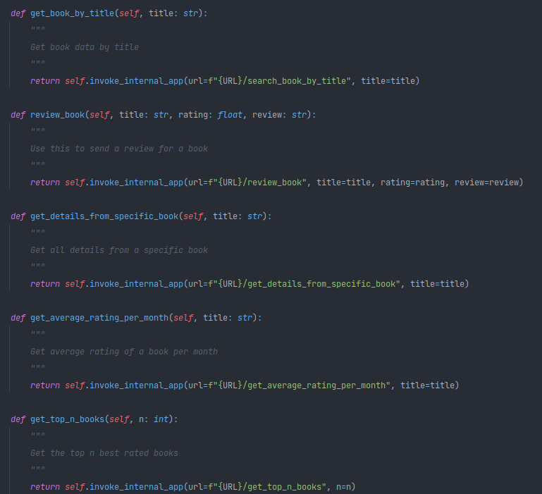

# Search book #

## INTRO ##
This is a tool for searching books using an API

## Running ##
Open your terminal and run:

$ pip install -e search_book/

$ run_server

After that you can use the functions inside the search_book.rest to test every endpoint

OBS: a database will be created on a hidden folder on your home

## CONTACT ##
Please send bugs, patches, and reviews to:
 - William Freitas (williamdov.c.f@gmail.com)
